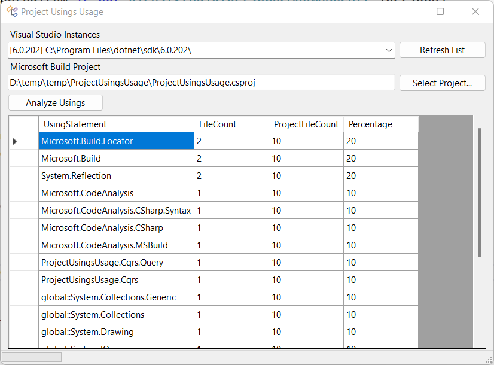

# Project Usings Usage
## Sometimes you just want to write something using Winforms

This application will analyze a project and give you a sorted list of using statements based on the count of its usage in the project files. I'm using this to identify using statements that I may want to move to a global usings file or global using project setting.

## Screenshot

